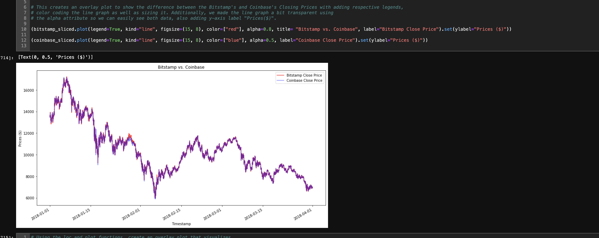

# Crypto Arbitrage


## Overview

The Crypto Abritrage project is about understanding the profits from different exchanges. It analyzes different periods of time to check what are the profits for each period. It also gives you a visual analysis of its data.

---

## Technologies

This project leverages **[python version 3.8.5](https://www.python.org/downloads/)** with the following packages and modules:

* [pandas](https://pandas.pydata.org/docs/) - This was used to be able to easily manipulate dataframes.

* [pathlib](https://docs.python.org/3/library/pathlib.html) - This was used to locate through the directory or file path. Also, it converts a string and converts that supplied string as a PosixPath that can be utilize by other functions such as reading or writing files to csv files.

* [Jupyter Lab](https://jupyterlab.readthedocs.io/en/stable/) - This was used to be able to create and share documents that contain live code, equations, visualizations and narrative text.

---

## Installation Guide

In this section, you should include detailed installation notes containing code blocks and screenshots.

```python
    pip install jupyterlab
 
```

On the terminal, under the conda dev environment, install the following:
 * Jupyter Lab 

    `pip install jupyterlab`

    - This will allows us to open our iPython notebook.

---

## Examples

This gif below shows how the loan qualifier works for the user.



---

## Contributors


Contributed by: Justine Cho

Email: chojustine0@gmail.com

[ LinkedIn](https://www.linkedin.com/in/justinecho)

